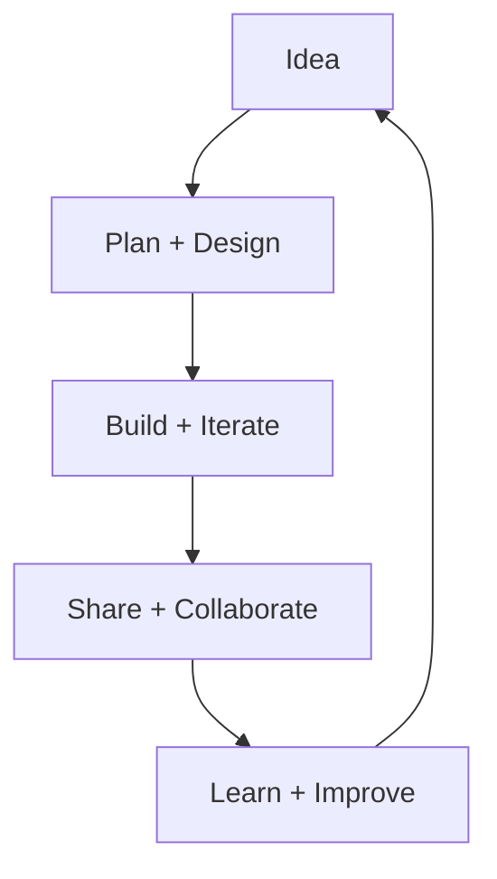

# Hi, I'm Fretux 👋

<p align="center">
  <a href="https://github.com/Fretuks">
    
  </a>
  
  
</p>

Welcome to my GitHub profile! I enjoy turning ideas into clean, readable, and user‑friendly software. I’m especially interested in building thoughtful experiences, learning new tools, and collaborating with others.

## About Me
- Curious and always learning
- I like working across the stack, from UI polish to backend logic
- Open to collaboration and feedback

## Tech & Tools

| Category | Highlights |
| --- | --- |
| **Languages** | JavaScript, Python, HTML/CSS, Java |
| **Frameworks** | Express |
| **Tools** | Git, GitHub Actions, Docker |

> _Always exploring new tools._

## What I’m Up To

```text
Learning: deeper backend patterns + automation
Building: small projects to sharpen my skills
Collaboration: open to feedback and pairing
```

## Focus Areas



## Let’s Connect
- GitHub: [@Fretuks](https://github.com/Fretuks)
- Mail: [fretux@fretux.ch](mailto:fretux@fretux.ch)
- Discord: Fretux

---

Thanks for stopping by! Feel free to check out my repositories and say hello.
